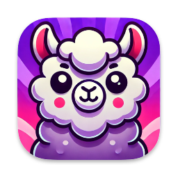
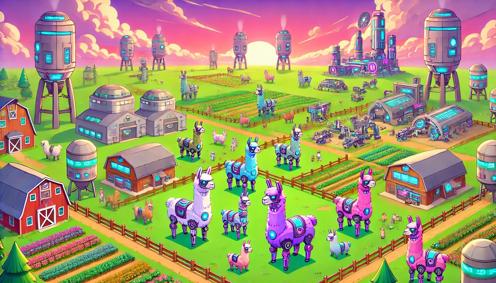
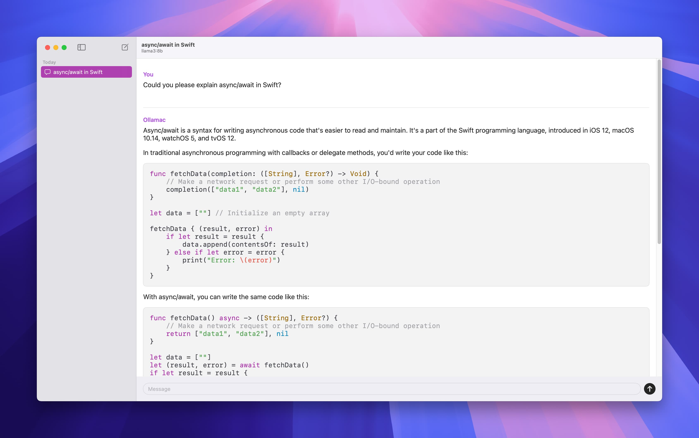

<div>
  <div align="center">
    
    <h1>Ollamac - Mac app for <a href="https://github.com/ollama/ollama">Ollama</a></h1>
    <picture>
      <source media="(prefers-color-scheme: dark)" srcset="./assets/banner-night.jpg">
      
    </picture>
  </div>
<div>

## ⚠️ Important Notice

> Ollamac is always free and open-source. You can only download Ollamac from this official repository. Any commercial apps that use the name Ollamac are not affiliated with or endorsed by me, the original creator.

## Prerequisites

- macOS 14.0 Sonoma or later.
- Ollama should be installed on your Mac and ensure you have at least one Ollama model pulled.

## Installation

### Using Homebrew

```bash
brew install --cask ollamac
```

### Download from GitHub

You can download the latest version of Ollamac from the [releases page](https://github.com/kevinhermawan/Ollamac/releases).

## Features

- Works with all Ollama models.
- Customizable host.
- Syntax highlighting.
- Simple and easy to use.
- Free and open source.
- Native.

And more...

## Screenshot

<div align="center">
  <picture>
    <source media="(prefers-color-scheme: dark)" srcset="./assets/screenshot-dark.jpg">
    
  </picture>
</div>

## Supporters

I'm grateful for the support from the community that enables me to continue developing open-source tools. Among these supporters is [BoltAI](https://boltai.com?ref=ollamac), another ChatGPT app for Mac that excels in both design and functionality. Like Ollamac, [BoltAI](https://boltai.com?ref=ollamac) offers offline capabilities through Ollama, providing a seamless experience even without internet access. If you value reliable and elegant tools, [BoltAI](https://boltai.com?ref=ollamac) is definitely worth exploring.

## Acknowledgements

- [ChatField by @kevinhermawan](https://github.com/kevinhermawan/ChatField)
- [Defaults by @sindresorhus](https://github.com/sindresorhus/Defaults)
- [Highlightr by @raspu](https://github.com/raspu/Highlightr)
- [OllamaKit by @kevinhermawan](https://github.com/kevinhermawan/OllamaKit)
- [Sparkle by @sparkle-project](https://github.com/sparkle-project/Sparkle)
- [swift-markdown-ui by @gonzalezreal](https://github.com/gonzalezreal/swift-markdown-ui)
- [ViewCondition by @kevinhermawan](https://github.com/kevinhermawan/ViewCondition)
- [ViewState by @kevinhermawan](https://github.com/kevinhermawan/ViewState)
- [swiftui-introspect by @siteline](https://github.com/siteline/swiftui-introspect)

## License

This repository is available under the [Apache License 2.0](/LICENSE), with a few additional restrictions.
