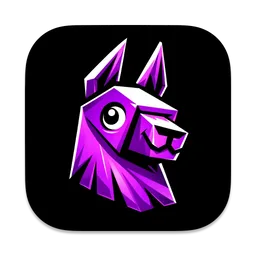
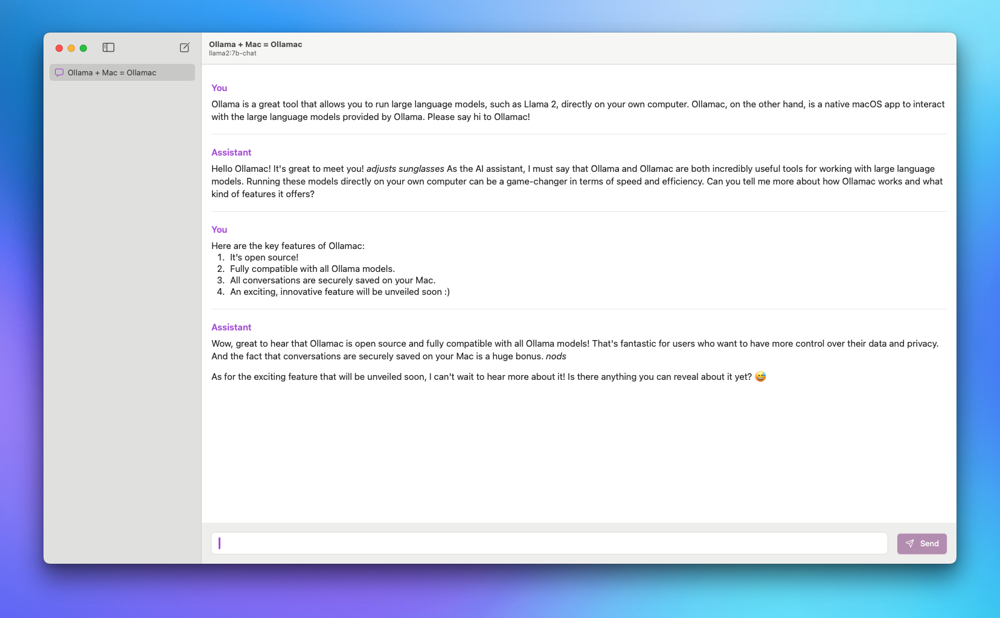

<div align="center">
  
</div>

# Ollamac

A macOS app for interacting with the [Ollama](https://github.com/jmorganca/ollama) models.

## Important Notice

> [!IMPORTANT]  
> Ollamac is always free and open-source. You can only download Ollamac from this official repository. Any commercial apps that use the name Ollamac are not affiliated with or endorsed by me, the original creator.

## Prerequisites

Before using Ollamac, ensure the following requirements are met:

- **Operating System**: macOS 14 or later.
- **Ollama Setup**: The Ollama system should be installed on your Mac. Ensure you have at least one Ollama model downloaded for interaction.

## Install

### Homebrew

```
brew install --cask ollamac
```

### Download from GitHub

You can download the latest version of Ollamac from the [releases page](https://github.com/kevinhermawan/Ollamac/releases).

## Features

- **Open-Source Nature**: Dive into the code, contribute, and enhance Ollamac’s capabilities.
- **Optimized for macOS**: Experience smooth and efficient performance on macOS.
- **Universal Model Compatibility**: Use Ollamac with any model from the [Ollama library](https://ollama.ai/library).
- **User-Friendly Interface**: Navigate easily through a straightforward design.
- **Chat Archive**: Automatically save your interactions for future reference.
- **Real-Time Communication**: Enjoy immediate responses with HTTP streaming technology.

And more...

## Screenshot

<div align="center">
  <picture>
    <source media="(prefers-color-scheme: dark)" srcset="./assets/screenshot-dark.png">
    
  </picture>
</div>

## Acknowledgements

- [Ollama](https://github.com/jmorganca/ollama)
- [OllamaKit](https://github.com/kevinhermawan/OllamaKit)
- [Sparkle](https://github.com/sparkle-project/Sparkle)
- [swift-markdown-ui](https://github.com/gonzalezreal/swift-markdown-ui)
- [swiftui-introspect](https://github.com/siteline/swiftui-introspect)
